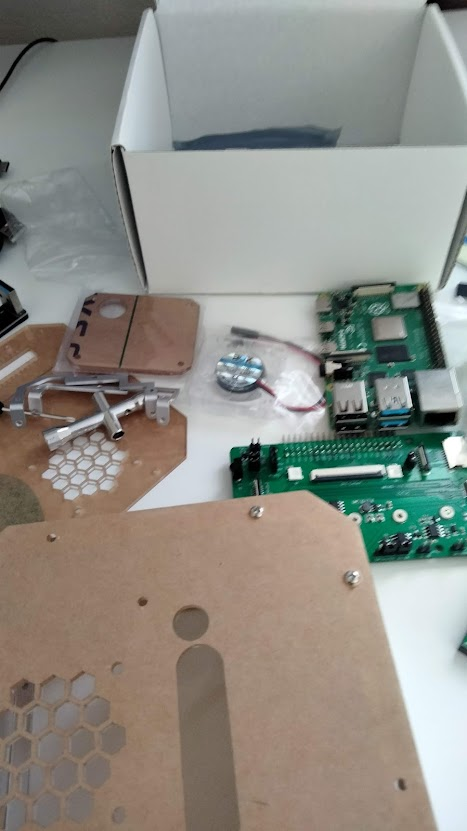

# June 13, 2025

#### Time spent: 1.5 hour

This is the start of my setup server project. My goal is to create a server that controls various components of my setup, which includes RGB lights, hex panels, and other peripherals such as keyboards. The package includes various components to house the raspberry pi (thermal paste, casing, and fans) and a pre-built PCB board which connects the components together.

Most of today's time was brainstorming on how to connect my entire setup together while maintaing the aesthetic of my desk. I don't like wires everywhere so I am coming up with ways to hide them. This is challenging because a connecting wires for each component is required

# June 17, 2025

#### Time spent: 2 hours

Today I assembled the components to create the server! It took a long time because I had installed the PCB on the standoffs in the reverse direction which required me to undo everything to flip it around. It was my first time workign with circuits in general and took a while to open the white bracket (don't know the name) that extends the GPIO pins from the Raspberry Pi to the PCB

| During                                              | Assembly                                            | After assembly complete                             |
| --------------------------------------------------- | --------------------------------------------------- | --------------------------------------------------- |
|  |  |  |

# June 26, 2025

#### Time spent: 0.5 hours

It's been a while since I last worked on this (because of finals). Today I flashed Debian on the Raspberry Pi. I installed Node.JS since I am familiar with TypeScript and I plan to use this for the server.

I also swapped out my low power iPhone charger to a 65W charger to power it since it kept shutting down.
